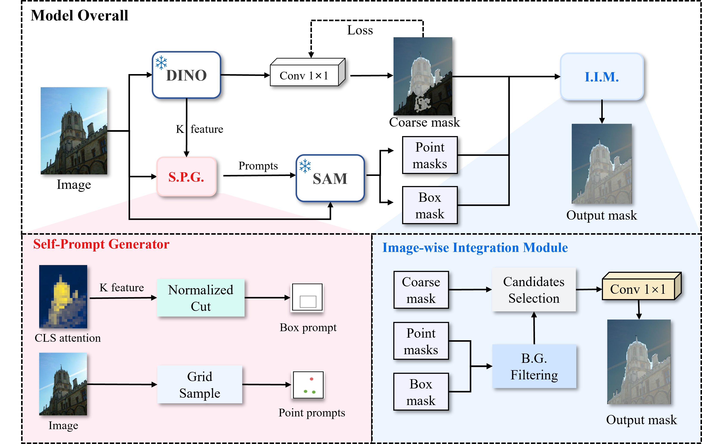
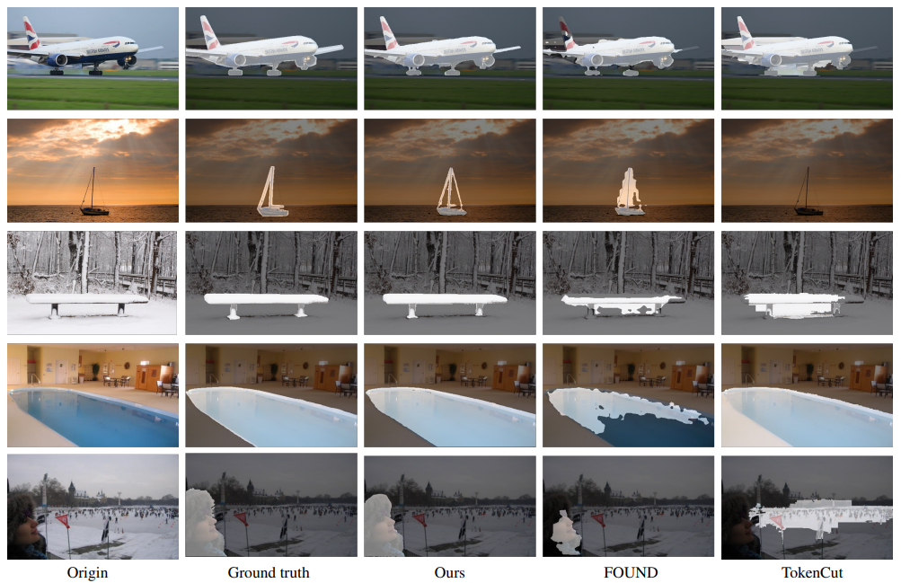

# SelfLoc

<h3>SelfLoc: High Quality Unsupervised Object Localization with Self-Prompt SAM</h3>

<p align="center">
     <br />
</p>

---

## Installation

### Dependencies

This code was implemented with python 3.8, PyTorch 1.13.1 and CUDA 12.2. Please install [PyTorch](https://pytorch.org/). In order to install the additionnal dependencies, please launch the following command:

```bash
# Create conda environment
conda env create -f environment.yml
```

Please Install SAM. The SAM model can be installed using the following commands:

```bash
pip install git+https://github.com/facebookresearch/segment-anything.git
```

Please also Install DINO. The DINO model can be installed using the following commands:

```bash
git clone https://github.com/facebookresearch/dino.git
cd dino; 
touch __init__.py
echo -e "import sys\nfrom os.path import dirname, join\nsys.path.insert(0, join(dirname(__file__), '.'))" >> __init__.py; cd ../;
```

## Model

- The self-prompt generator can be found in **self_prompt_generator.py**.

- The filtering implementation can be found in **filter.py**.

- The merge strategy can be found in **merge.py**.

## Evaluation

### Unsupervised Saliency Detection

```bash
python eval_selfloc.py --dataset_name datasetname --mask_root /path/to/gt/masks --pred_root /path/to/predictions
```

### Unsupervised Single Object Discovery

```
python eval_selfloc_uod.py --dataset_dir /path/to/dataset --dataset_name datasetname --predict_folder /path/to/predictions --output_dir /path/to/output
```

### Unsupervised Camouflaged Object Segmentation

```
python eval_selfloc.py --dataset_name datasetname --mask_root /path/to/gt/masks --pred_root /path/to/predictions
```

## Benchmark Results

<p align="center">
     <br />
    <em> 
    Table 1: Comparison of our SelfLoc and state-of-the-art unsupervised methods on salient object segmentation benchmark datasets. The best
and the second best results of each row are highlighted.
    </em>
</p>

<p align="center">
     <br />
    <em> 
Table 2: Comparison of our SelfLoc and state-of-the-art unsupervised methods on single object discovery benchmark datasets. C20k
refers to COCO20K dataset
    </em>
</p>


<p align="center">
     <br />
    <em> 
    Table 3: Comparison of our SelfLoc and state-of-the-art unsupervised methods on camouflaged object segmentation benchmark datasets. The
best and the second best results of each row are highlighted
    </em>
</p>

<p align="center">
     <br />
    <em> 
    Qualitative results of unsupervised object discovery and localization. We superimpose the masks generated by Ours, Found, and TokenCut onto images from DUTS, DUT-OMRON, ECSSD, and VOC07 datasets.
    </em>
</p>
